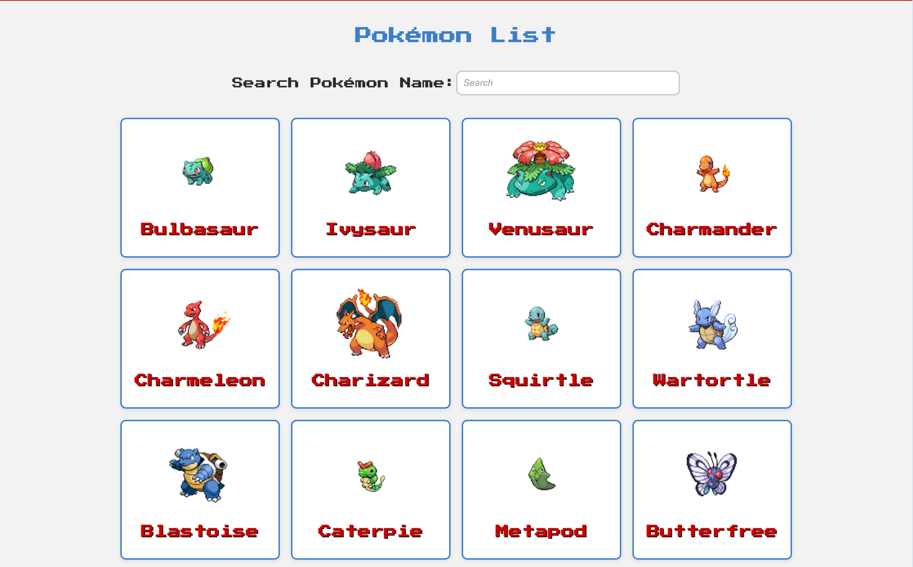
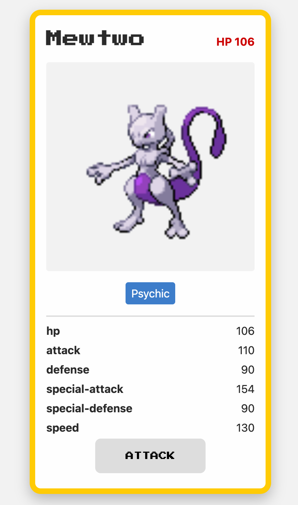

# Pokedex

A simple Pokédex web app built with React + Vite + TypeScript, styled with CSS Modules, and powered by the PokéAPI.

Browse Pokémon, filter by name, and view individual Pokémon details in a card-style layout inspired by the trading cards and video games.




## How to start the project

### Clone repo

`git clone https://github.com/Kenny-Hom27/pokedex.git`

`cd pokedex`

### Install packages

`npm install`

### Run dev

`npm run dev`

### Running tests

`npm run test`

## Project Structure

```
src/
  components/         # Reusable components (cards, buttons, header, footer)
    common/           # Shared UI like Button
    layout/           # Header, Footer
    pokemon/          # PokemonCard, PokemonDetail
  pages/              # Page-level components (ListPage, DetailPage)
  utils/              # API helpers, typeColors, etc.
  types/              # TypeScript types
  constants/          # App constants and ARIA strings
  App.tsx             # Main app with routing
```


## API Usage

### List of Pokemon

`https://pokeapi.co/api/v2/pokemon?offset=0&limit=20`

### Individual Pokemon

`https://pokeapi.co/api/v2/pokemon/{id}`

